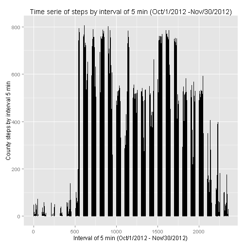

## Analysis of data collected of movement of one individual by activity monitoring device  
#### Author: CsoaresF   
=========================================  
## Introduction
Analysis of data about personal movement using activity monitoring devices.   
The device collects dat at 5 minute intervals through out the day.   
The data consists of two months of data an anonymous individual collected during the months of October and November 2012 and include the number of steps taken in 5 minute interval each day.      
   
#### Dataset: Activity monitoring data [52k]   
*  The dataset is stored in a comma-separated-value (CSV) file.   
*  There are a total of 17,568 observations in this dataset.
*  url for download: https://d396qusza40orc.cloudfront.net/repdata%2Fdata%2Factivity.zip   
    
*  Variables of dataset:
    +  __steps__: Number of steps in a 5 minute interval   
          (missing values are coded as NA)   
    +  __date__: The date on wich the measurement was taken   
          format: YYYY-MM-DD   
    +  __interval__: Identifier for the 5 minute interval in which measurement was taken   


## 1- Loading and preprocessing the data   

```r
# libraries
library(dplyr)
```

```
## 
## Attaching package: 'dplyr'
## 
## The following objects are masked from 'package:stats':
## 
##     filter, lag
## 
## The following objects are masked from 'package:base':
## 
##     intersect, setdiff, setequal, union
```

```r
library(ggplot2)
#################

# work directory
setwd("C:/COURSERA5")
# if file is not exist in work directory, download and unzip
if(!file.exists("activity.csv")) {
    file <- "activity.zip"
    web <- "https://d396qusza40orc.cloudfront.net/repdata%2Fdata%2Factivity.zip"
    download.file(web, file)
    unzip(file)
}

# load spreadsheet to work space
activity <- read.csv("activity.csv")

#  view file structure
str(activity)
```

```
## 'data.frame':	17568 obs. of  3 variables:
##  $ steps   : int  NA NA NA NA NA NA NA NA NA NA ...
##  $ date    : Factor w/ 61 levels "2012-10-01","2012-10-02",..: 1 1 1 1 1 1 1 1 1 1 ...
##  $ interval: int  0 5 10 15 20 25 30 35 40 45 ...
```
## 2- What is mean total number of steps taken per day?   

```r
# total steps by day (using dplyr)
tot.steps.day <- activity %>%                    # read activity,
  group_by(date) %>%                             # group by date,
  summarise(steps = sum(steps, na.rm=FALSE)) %>% # summarise steps (with NAs),
  arrange(date)                                  # and order by date.

# returns the five first rows
head(tot.steps.day, 5)
```

```
## Source: local data frame [5 x 2]
## 
##         date steps
##       (fctr) (int)
## 1 2012-10-01    NA
## 2 2012-10-02   126
## 3 2012-10-03 11352
## 4 2012-10-04 12116
## 5 2012-10-05 13294
```

```r
# quartis of total steps by day (with NAs)
summary(tot.steps.day$steps)
```

```
##    Min. 1st Qu.  Median    Mean 3rd Qu.    Max.    NA's 
##      41    8841   10760   10770   13290   21190       8
```
*  The mean is 10,770 steps by day.   
*  The median is 10,760 steps by day.   
*  Including the rows with "NAs", mean and medin are very close.   
   

```r
# histogram (with NAs)
qplot(tot.steps.day$steps, 
      geom = "histogram",
      binwidth = 0.5) +
  labs(title="Histogram steps by day") +
  labs(x="Quantity steps by day") +
  labs(y="Count days")
```

 

```r
#
# Quantity of steps per day, one person, for 61 days (Oct/1/2012 - Nov/30/2012).
print(tot.steps.day$steps)
```

```
##  [1]    NA   126 11352 12116 13294 15420 11015    NA 12811  9900 10304
## [12] 17382 12426 15098 10139 15084 13452 10056 11829 10395  8821 13460
## [23]  8918  8355  2492  6778 10119 11458  5018  9819 15414    NA 10600
## [34] 10571    NA 10439  8334 12883  3219    NA    NA 12608 10765  7336
## [45]    NA    41  5441 14339 15110  8841  4472 12787 20427 21194 14478
## [56] 11834 11162 13646 10183  7047    NA
```

## 3- What is the average daily activity pattern?   

```r
# 
# time serie with ggplot2
##########################
qplot(data=activity, 
     x=interval,
     y=steps,
     geom="line") +
  labs(title="Time serie of steps by interval of 5 min (Oct/1/2012 -Nov/30/2012)") +
  labs(x="Interval of 5 min (Oct/1/2012 - Nov/30/2012)") +
  labs(y="County steps by interval 5 min")
```

```
## Warning: Removed 2 rows containing missing values (geom_path).
```

 
#
## 4- Imputing missing values   

```r
# 
# total steps by day without NAs (using dplyr)
tot.steps.day2 <- activity %>%                  # read activity,
  group_by(date) %>%                            # group by date,
  summarise(steps = sum(steps, na.rm=TRUE)) %>% # summarise steps (without NAs),
  arrange(date)                                 # and order by date.

# quartis of total steps by day (without NAs)
summary(tot.steps.day2$steps)
```

```
##    Min. 1st Qu.  Median    Mean 3rd Qu.    Max. 
##       0    6778   10400    9354   12810   21190
```


#
## 5- Are there differences in activity patterns between weekdays and weekends?   
   
Weekends: Sat, Sun.    
Weekdays: Mon, Tues, Wed, Thurs, Fri.   

```r
# 
```
