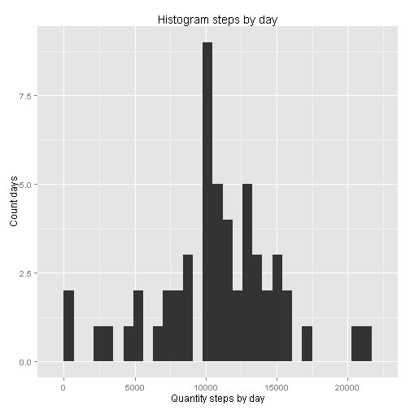
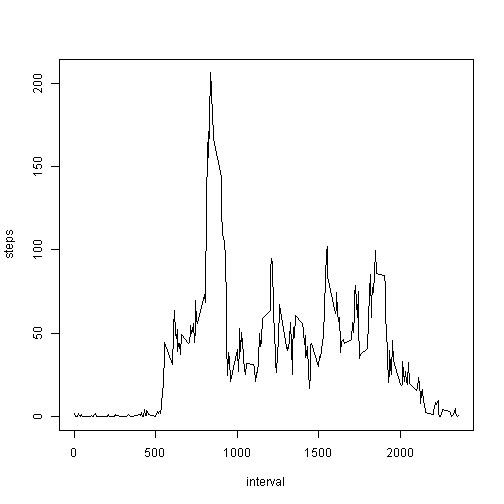

---
title: "Reproducible Research: Peer  Assessment 1"
subtitle: "Analysis of movement of data collected of one individual by activity monitoring device"
author: CSoaresF   
date: Jan 09, 2016
output: html_document:   
        keep_md: true   
--- 
## Analysis of data collected of movement of one individual by activity monitoring device  
#### CsoaresF   
=========================================  
## Introduction
Analysis of data about personal movement using activity monitoring devices.   
The device collects dat at 5 minute intervals through out the day.   
The data consists of two months of data an anonymous individual collected during the months of October and November 2012 and include the number of steps taken in 5 minute interval each day.      
   
#### Dataset: Activity monitoring data [52k]   
*  The dataset is stored in a comma-separated-value (CSV) file.   
*  There are a total of 17,568 observations in this dataset.
*  url for download: https://d396qusza40orc.cloudfront.net/repdata%2Fdata%2Factivity.zip   
    
*  Variables of dataset:
    +  __steps__: Number of steps in a 5 minute interval   
          (missing values are coded as NA)   
    +  __date__: The date on wich the measurement was taken   
          format: YYYY-MM-DD   
    +  __interval__: Identifier for the 5 minute interval in which measurement was taken   


## 1- Loading and preprocessing the data   

```r
# libraries
library(lattice)
library(ggplot2)
library(plyr)
library(dplyr)
```

```
## 
## Attaching package: 'dplyr'
## 
## The following objects are masked from 'package:plyr':
## 
##     arrange, count, desc, failwith, id, mutate, rename, summarise,
##     summarize
## 
## The following objects are masked from 'package:stats':
## 
##     filter, lag
## 
## The following objects are masked from 'package:base':
## 
##     intersect, setdiff, setequal, union
```

```r
#################

# work directory
setwd("C:/COURSERA5")
# if file is not exist in work directory, download and unzip
if(!file.exists("activity.csv")) {
    file <- "activity.zip"
    web <- "https://d396qusza40orc.cloudfront.net/repdata%2Fdata%2Factivity.zip"
    download.file(web, file)
    unzip(file)
}

# load spreadsheet to work space
activity <- read.csv("activity.csv")

# conversion to date
activity$date <- as.Date(as.character(activity$date), "%Y-%m-%d")

#  view file structure
str(activity)
```

```
## 'data.frame':	17568 obs. of  3 variables:
##  $ steps   : int  NA NA NA NA NA NA NA NA NA NA ...
##  $ date    : Date, format: "2012-10-01" "2012-10-01" ...
##  $ interval: int  0 5 10 15 20 25 30 35 40 45 ...
```
## 2- What is mean total number of steps taken per day?   

```r
# total steps by day (using dplyr)
tot.steps.day <- activity %>%                    # read activity,
  group_by(date) %>%                             # group by date,
  summarise(steps = sum(steps, na.rm=FALSE)) %>% # summarise steps (with NAs),
  arrange(date)                                  # and order by date.

# view file struture
str(tot.steps.day)
```

```
## Classes 'tbl_df', 'tbl' and 'data.frame':	61 obs. of  2 variables:
##  $ date : Date, format: "2012-10-01" "2012-10-02" ...
##  $ steps: int  NA 126 11352 12116 13294 15420 11015 NA 12811 9900 ...
```

```r
# number of days in dataset
length(tot.steps.day$date)
```

```
## [1] 61
```

```r
# total steps by day (with NAs)
summary(tot.steps.day)
```

```
##       date                steps      
##  Min.   :2012-10-01   Min.   :   41  
##  1st Qu.:2012-10-16   1st Qu.: 8841  
##  Median :2012-10-31   Median :10765  
##  Mean   :2012-10-31   Mean   :10766  
##  3rd Qu.:2012-11-15   3rd Qu.:13294  
##  Max.   :2012-11-30   Max.   :21194  
##                       NA's   :8
```
*  The mean is 10,770 steps by day.   
*  The median is 10,760 steps by day.   
*  Ignoring missing values in the data, mean and medin are very close.   
   

```r
# histogram (with NAs)
qplot(tot.steps.day$steps, 
      geom = "histogram",
      binwidth = 700) +
  labs(title="Histogram steps by day") +
  labs(x="Quantity steps by day") +
  labs(y="Count days")
```

 

```r
#
# Quantity of steps per day, one person, for 61 days (Oct/1/2012 - Nov/30/2012).
print(tot.steps.day$steps)
```

```
##  [1]    NA   126 11352 12116 13294 15420 11015    NA 12811  9900 10304
## [12] 17382 12426 15098 10139 15084 13452 10056 11829 10395  8821 13460
## [23]  8918  8355  2492  6778 10119 11458  5018  9819 15414    NA 10600
## [34] 10571    NA 10439  8334 12883  3219    NA    NA 12608 10765  7336
## [45]    NA    41  5441 14339 15110  8841  4472 12787 20427 21194 14478
## [56] 11834 11162 13646 10183  7047    NA
```

## 3- What is the average daily activity pattern?   

```r
# 
# time series plot (type = "l")
# interval 5min: x-axis
# mean of steps taken: y-axis
mean.steps <- aggregate(steps ~ interval, data = activity, FUN = mean)
plot(mean.steps, type = "l")
```

 
#
## 4- Imputing missing values   

```r
# 
summary(activity)
```

```
##      steps             date               interval     
##  Min.   :  0.00   Min.   :2012-10-01   Min.   :   0.0  
##  1st Qu.:  0.00   1st Qu.:2012-10-16   1st Qu.: 588.8  
##  Median :  0.00   Median :2012-10-31   Median :1177.5  
##  Mean   : 37.38   Mean   :2012-10-31   Mean   :1177.5  
##  3rd Qu.: 12.00   3rd Qu.:2012-11-15   3rd Qu.:1766.2  
##  Max.   :806.00   Max.   :2012-11-30   Max.   :2355.0  
##  NA's   :2304
```

```r
summary(tot.steps.day)
```

```
##       date                steps      
##  Min.   :2012-10-01   Min.   :   41  
##  1st Qu.:2012-10-16   1st Qu.: 8841  
##  Median :2012-10-31   Median :10765  
##  Mean   :2012-10-31   Mean   :10766  
##  3rd Qu.:2012-11-15   3rd Qu.:13294  
##  Max.   :2012-11-30   Max.   :21194  
##                       NA's   :8
```

```r
#######################################
# total steps by day without NAs
tot.steps.day2 <- activity %>%                  # read activity,
  group_by(date) %>%                            # group by date,
  summarise(steps = sum(steps, na.rm=TRUE)) %>% # summarise steps (without NAs),
  arrange(date)                                 # and order by date.

# 
summary(tot.steps.day2)
```

```
##       date                steps      
##  Min.   :2012-10-01   Min.   :    0  
##  1st Qu.:2012-10-16   1st Qu.: 6778  
##  Median :2012-10-31   Median :10395  
##  Mean   :2012-10-31   Mean   : 9354  
##  3rd Qu.:2012-11-15   3rd Qu.:12811  
##  Max.   :2012-11-30   Max.   :21194
```

```r
############################ 4444444444
steps.by.day <- aggregate(steps ~ date, data = activity, sum, na.rm = TRUE)
############################## 44444444
# missing values in activity dataset
missing <- !complete.cases(activity)
sum(missing == TRUE)
```

```
## [1] 2304
```

```r
# 
activity2 <- activity[missing == TRUE, ]
steps.by.interval <- aggregate(steps ~ interval, data = activity, mean, na.rm = TRUE)
activity2[, 1] <- steps.by.interval$step
# activity3: dataset with missing data filled in 
activity3 <- rbind(activity[complete.cases(activity), ], activity2)
summary(activity2)
```

```
##      steps              date               interval     
##  Min.   :  0.000   Min.   :2012-10-01   Min.   :   0.0  
##  1st Qu.:  2.486   1st Qu.:2012-10-26   1st Qu.: 588.8  
##  Median : 34.113   Median :2012-11-06   Median :1177.5  
##  Mean   : 37.383   Mean   :2012-11-01   Mean   :1177.5  
##  3rd Qu.: 52.835   3rd Qu.:2012-11-11   3rd Qu.:1766.2  
##  Max.   :206.170   Max.   :2012-11-30   Max.   :2355.0
```

```r
summary(activity3)
```

```
##      steps             date               interval     
##  Min.   :  0.00   Min.   :2012-10-01   Min.   :   0.0  
##  1st Qu.:  0.00   1st Qu.:2012-10-16   1st Qu.: 588.8  
##  Median :  0.00   Median :2012-10-31   Median :1177.5  
##  Mean   : 37.38   Mean   :2012-10-31   Mean   :1177.5  
##  3rd Qu.: 27.00   3rd Qu.:2012-11-15   3rd Qu.:1766.2  
##  Max.   :806.00   Max.   :2012-11-30   Max.   :2355.0
```

```r
#
# total steps by day with missing data filled in
steps.by.day3 <- aggregate(steps ~ date, data = activity3, sum)
hist(steps.by.day3$steps)
```

 

```r
summary(steps.by.day3)
```

```
##       date                steps      
##  Min.   :2012-10-01   Min.   :   41  
##  1st Qu.:2012-10-16   1st Qu.: 9819  
##  Median :2012-10-31   Median :10766  
##  Mean   :2012-10-31   Mean   :10766  
##  3rd Qu.:2012-11-15   3rd Qu.:12811  
##  Max.   :2012-11-30   Max.   :21194
```
#
## 5- Are there differences in activity patterns between weekdays and weekends?   
   
Weekends: Saturday (sáb), Sunday (dom).    
Weekdays: Mon (seg), Tues (ter), Wed (qua), Thurs (qui), Fri (sex).   

```r
# 
activity3$day.week <- weekdays(activity3$date, abbreviate = TRUE)
head(activity3)
```

```
##     steps       date interval day.week
## 289     0 2012-10-02        0      ter
## 290     0 2012-10-02        5      ter
## 291     0 2012-10-02       10      ter
## 292     0 2012-10-02       15      ter
## 293     0 2012-10-02       20      ter
## 294     0 2012-10-02       25      ter
```

```r
tail(activity3)
```

```
##           steps       date interval day.week
## 17563 2.6037736 2012-11-30     2330      sex
## 17564 4.6981132 2012-11-30     2335      sex
## 17565 3.3018868 2012-11-30     2340      sex
## 17566 0.6415094 2012-11-30     2345      sex
## 17567 0.2264151 2012-11-30     2350      sex
## 17568 1.0754717 2012-11-30     2355      sex
```

```r
#
activity3$day.week[activity3$day.week == "sáb" | activity3$day.week == "dom"] <- "weekend"
activity3$day.week[activity3$day.week != "weekend"] <- "weekday"
activity3$day.week <- as.factor(activity3$day.week)
head(activity3)
```

```
##     steps       date interval day.week
## 289     0 2012-10-02        0  weekday
## 290     0 2012-10-02        5  weekday
## 291     0 2012-10-02       10  weekday
## 292     0 2012-10-02       15  weekday
## 293     0 2012-10-02       20  weekday
## 294     0 2012-10-02       25  weekday
```

```r
str(activity3)
```

```
## 'data.frame':	17568 obs. of  4 variables:
##  $ steps   : num  0 0 0 0 0 0 0 0 0 0 ...
##  $ date    : Date, format: "2012-10-02" "2012-10-02" ...
##  $ interval: int  0 5 10 15 20 25 30 35 40 45 ...
##  $ day.week: Factor w/ 2 levels "weekday","weekend": 1 1 1 1 1 1 1 1 1 1 ...
```

```r
#
# painel plot weekday x weekend
# interval 5m x-axis
# mean steps y-axis
activity4 <- ddply(activity3, .(interval, day.week), summarise, mean.steps = mean(steps))
summary(activity4)
```

```
##     interval         day.week     mean.steps     
##  Min.   :   0.0   weekday:288   Min.   :  0.000  
##  1st Qu.: 588.8   weekend:288   1st Qu.:  2.047  
##  Median :1177.5                 Median : 28.133  
##  Mean   :1177.5                 Mean   : 38.988  
##  3rd Qu.:1766.2                 3rd Qu.: 61.263  
##  Max.   :2355.0                 Max.   :230.378
```

```r
#
xyplot(mean.steps ~ interval | day.week, data = activity4, type = "l", lwd = 2, layout = c(1, 2), ylab = "Number of steps")
```

 
